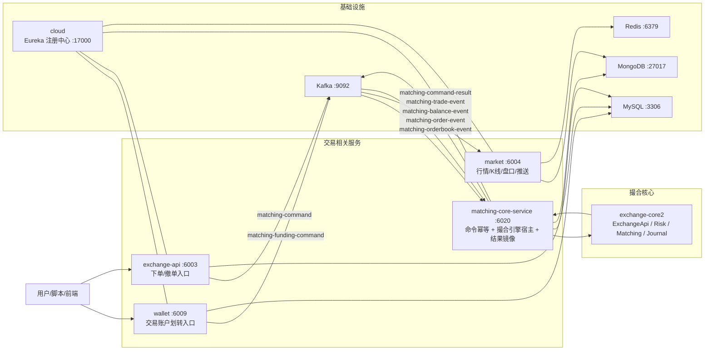
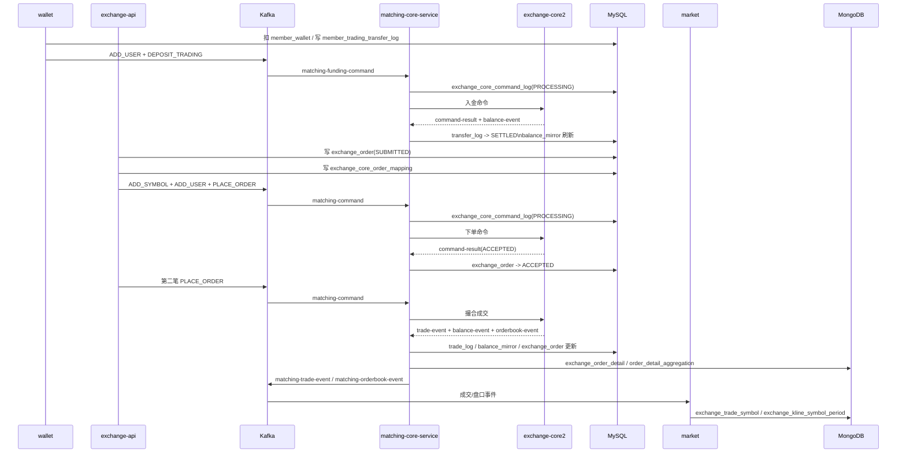

# 现货撮合链路架构说明

> 这份文档只讲当前仓库里的**新现货撮合链路**：`cloud -> wallet -> matching-core-service -> exchange-api -> market`。  

---

## 1. 这份文档解决什么问题

1. 这套新撮合架构整体怎么工作。
2. MySQL、MongoDB、Kafka 在整个项目里各承担什么角色。
3. `matching-core-service` 为什么存在，它解决了什么问题，又引入了什么成本。
4. 这套项目在单机场景下如何启动、如何做闭环验证。
5. 如果把它往真实高可用、分布式交易系统演进，合理的路线是什么。
6. 站在主流市场技术视角，如何客观评价这个项目。

---

## 2. 项目一句话总结

这是一个典型的**单机版、事件驱动式的现货交易系统**：

- `wallet` 负责平台主钱包与交易账户之间的资金入场
- `exchange-api` 负责下单/撤单接入与业务校验
- `matching-core-service` 负责命令幂等、承载 `exchange-core2` 撮合核心、产出交易事件并回写镜像
- `market` 负责成交行情、K 线、盘口和实时推送
- `Kafka` 负责把这些服务之间的命令流和事件流串起来
- `MySQL` 负责业务主状态和可靠幂等日志
- `MongoDB` 负责成交明细、订单明细聚合、K 线等高写入/时序读模型

---

## 3. 架构全貌

### 3.1 服务级总图



### 3.2 一笔交易的主时序



---

## 4. 五个服务各自负责什么

| 服务 | 端口 | 真实职责 | 不负责什么 |
| --- | --- | --- | --- |
| `cloud` | `17000` | Eureka 注册中心，做服务发现 | 不做交易，不做网关，不做撮合 |
| `wallet` | `6009` | 平台主钱包与交易账户之间的资金划转入口，交易前资金入场 | 不负责撮合，不负责订单簿 |
| `exchange-api` | `6003` | 下单/撤单接入、业务校验、订单落库、生成 `CoreOrderMapping`、发撮合命令 | 不做真正撮合 |
| `matching-core-service` | `6020` | Kafka 命令消费、命令幂等、承载 `exchange-core2`、产出撮合事件、回写镜像表、查询/管理接口 | 不直接做前端推送 |
| `market` | `6004` | 消费成交/盘口事件，生成成交流、K 线、行情快照，做推送 | 不做撮合决策 |

代码锚点：

- `cloud`：`00_framework/cloud/src/main/java/com/bizzan/bitrade/CloudApplication.java`
- `wallet`：`00_framework/wallet/src/main/java/com/bizzan/bitrade/controller/TradingTransferController.java`
- `exchange-api`：`00_framework/exchange-api/src/main/java/com/bizzan/bitrade/controller/OrderController.java`
- `matching-core-service`：`00_framework/matching-core-service/src/main/java/com/bizzan/bitrade/service/ExchangeCoreCommandService.java`
- `market`：`00_framework/market/src/main/java/com/bizzan/bitrade/consumer/ExchangeTradeConsumer.java`

---

## 5. MySQL 与 MongoDB 到底存了什么

这一节很重要。  
这个项目不是“所有东西都进 MySQL”，也不是“所有东西都进 MongoDB”，而是做了非常明确的分工。

---

## 6. MySQL 表清单与业务作用

### 6.1 平台钱包层

这部分是用户真正“主钱包资产”的来源。

| 表 | 来源 | 作用 | 业务意义 |
| --- | --- | --- | --- |
| `member_wallet` | `MemberWallet` 实体，代码中大量原生 SQL 直接访问 | 用户平台主钱包余额、冻结余额 | 用户还没把钱转进撮合引擎前，资产就在这里 |
| `member_transaction` | `MemberTransaction` 实体 | 钱包流水、划转流水、充值提现等交易记录 | 给用户和运营看“发生过什么资产动作” |

代码锚点：

- `member_wallet`
  - `00_framework/core/src/main/java/com/bizzan/bitrade/entity/MemberWallet.java`
  - `00_framework/exchange-core/src/main/java/com/bizzan/bitrade/service/ExchangeOrderService.java:305`
- `member_transaction`
  - `00_framework/core/src/main/java/com/bizzan/bitrade/entity/MemberTransaction.java`
  - `00_framework/core/src/main/java/com/bizzan/bitrade/service/MemberTransactionService.java`

业务理解：

- `member_wallet` 是“平台主账”
- `member_transaction` 是“主账流水”

如果没有这两张表，`wallet` 无法完成“先扣主钱包，再把资金送入交易账户”的闭环。

### 6.2 新撮合链路的 MySQL 核心表

这些表是新链路真正新增或真正依赖的核心表。  
我特意加了一列“如果没有它会出什么错”，因为这比单纯说“很重要”更容易让人理解。

| 表 | 代码锚点 | 业务作用 | 为什么重要 | 反例：如果没有它会怎样 |
| --- | --- | --- | --- | --- |
| `exchange_core_symbol_mapping` | `CoreSymbolMapping` | 业务交易对与 `exchange-core2` 内部 `coreSymbolId` 的映射，附带 `scale_k`、基础币/计价币 ID 等 | 不解决这个映射，业务下单参数没法转成引擎内部整数精度世界 | 比如业务里下的是 `BTC/USDT`、价格是 `65000`、数量是 `0.01`，引擎里实际吃的是 `coreSymbolId + long/int` 精度体系；没有这张表，系统根本不知道 `BTC/USDT` 在引擎里是谁，也不知道 `0.01 BTC` 要换算成多少 core 单位 |
| `exchange_core_order_mapping` | `CoreOrderMapping` | `orderId -> coreOrderId` 的桥接表 | 业务单号和引擎单号是两套体系，必须靠它关联 | 没有这张表，前台看到的 `E178...` 无法对应引擎里的 `coreOrderId`，撤单找不到原单，成交回写时也不知道该更新哪条 `exchange_order` |
| `exchange_core_command_log` | `CoreCommandLog` | 命令幂等、处理状态、错误原因、payload 留痕 | Kafka 至少一次语义下防止重复命令进入引擎 | 假设 `PLACE_ORDER-E123` 因网络抖动被重复投递两次，如果没有这张表去查 `commandId`，同一笔单可能被重复送进引擎，结果就是重复挂单、重复撤单或重复入金 |
| `exchange_core_trade_log` | `CoreTradeLog` | 成交事件落地、成交幂等、对账依据 | 既是成交镜像，也是 trade 级幂等保护点 | 假设同一条 `matching-trade-event` 被重放两次，如果没有 `tradeId` 唯一保护，同一笔成交会被重复记账、重复写订单明细、重复改余额镜像 |
| `exchange_core_balance_mirror` | `CoreBalanceMirror` | 撮合引擎内部余额的 MySQL 镜像 | 钱真正是否能下单在引擎内，但业务系统要查，所以要镜像 | 如果没有这张表，`wallet` 和后台系统只能直接打撮合引擎内存查询；一旦服务重启、接口抖动或要做对账，业务侧就没有一个稳定可查的“交易账户余额视图” |
| `member_trading_transfer_log` | `MemberTradingTransferLog` | 记录从主钱包到交易账户、从交易账户回主钱包的划转命令与结果 | 平台资产层和撮合引擎层的桥梁日志 | 假设主钱包已经扣了 `1 BTC`，但发送撮合入金命令后服务挂了；没有这张表，就无法判断“这笔钱到底已经进引擎了，还是应该退款回主钱包” |

代码锚点：

- `00_framework/exchange-core/src/main/java/com/bizzan/bitrade/entity/CoreSymbolMapping.java`
- `00_framework/exchange-core/src/main/java/com/bizzan/bitrade/entity/CoreOrderMapping.java`
- `00_framework/exchange-core/src/main/java/com/bizzan/bitrade/entity/CoreCommandLog.java`
- `00_framework/exchange-core/src/main/java/com/bizzan/bitrade/entity/CoreTradeLog.java`
- `00_framework/exchange-core/src/main/java/com/bizzan/bitrade/entity/CoreBalanceMirror.java`
- `00_framework/exchange-core/src/main/java/com/bizzan/bitrade/entity/MemberTradingTransferLog.java`
- `00_framework/exchange-core/src/main/resources/sql/exchange_core_integration.sql`

### 6.3 订单主状态表

| 表 | 来源 | 作用 | 业务意义 |
| --- | --- | --- | --- |
| `exchange_order` | `ExchangeOrder` 实体，JPA 默认表名，验证脚本也直接查询该表 | 业务订单主表，订单状态从 `SUBMITTED -> ACCEPTED -> PARTIALLY_TRADED / COMPLETED / CANCELED / REJECTED` | 用户订单页、管理后台、撤单逻辑都要查它 |

代码锚点：

- `00_framework/exchange-core/src/main/java/com/bizzan/bitrade/entity/ExchangeOrder.java`
- `00_framework/exchange-core/src/main/java/com/bizzan/bitrade/service/ExchangeOrderService.java:93`
- `scripts/run-matching-core-e2e.sh:141`

这张表的重要意义是：

- 它是**业务世界看到的订单真相**
- `exchange-core2` 里有自己的内部订单结构，但业务系统不可能直接把引擎内存对象拿来做查询

---

## 7. MongoDB 集合清单与业务作用

这个项目里 MongoDB 承担的是**高写入、读模型、时序行情**角色。

### 7.1 订单成交明细与聚合

| 集合 | 代码锚点 | 作用 | 为什么放 Mongo |
| --- | --- | --- | --- |
| `exchange_order_detail` | `ExchangeOrderDetail` | 某个订单的逐笔成交明细 | 一张订单可能有很多撮合分片，文档式存储和按订单拉详情更自然 |
| `order_detail_aggregation` | `OrderDetailAggregation` | 订单维度的聚合明细查询模型 | 更适合做历史成交流水、用户明细页、报表视图 |

代码锚点：

- `00_framework/exchange-core/src/main/java/com/bizzan/bitrade/entity/ExchangeOrderDetail.java`
- `00_framework/exchange-core/src/main/java/com/bizzan/bitrade/entity/OrderDetailAggregation.java`
- `00_framework/matching-core-service/src/main/java/com/bizzan/bitrade/service/MatchingSettlementService.java:216`

### 7.2 行情时序集合

| 集合命名 | 代码锚点 | 作用 | 为什么放 Mongo |
| --- | --- | --- | --- |
| `exchange_trade_{symbol}` | `MongoMarketHandler.handleTrade(...)` / `MarketService.findTrade...` | 某交易对成交流 | 成交是典型 append-only 时间序列，Mongo 很适合按时间查询 |
| `exchange_kline_{symbol}_{period}` | `MongoMarketHandler.handleKLine(...)` / `MarketService.findAllKLine...` | 各周期 K 线 | K 线本质也是按时间维度查询的读模型 |

代码锚点：

- `00_framework/market/src/main/java/com/bizzan/bitrade/handler/MongoMarketHandler.java`
- `00_framework/market/src/main/java/com/bizzan/bitrade/service/MarketService.java`

### 7.3 这套 MySQL + Mongo 分工的本质

一句话概括：

- **MySQL 负责业务主状态与幂等可靠性**
- **MongoDB 负责高写入的成交明细、聚合明细、行情时序**

这是一种很常见的交易系统拆法。  
如果全部压到 MySQL：

- K 线和成交时序查询会很重
- 订单明细和行情明细会与主交易状态争抢资源

如果全部压到 Mongo：

- 命令幂等、资金状态、订单主状态、事务型更新又不够稳

所以当前仓库的存储分层，从思路上是合理的。

---

## 8. Kafka 在这个项目里到底起什么作用

这是当前文档里最值得强化的一节。

### 8.1 Kafka 不是“只是传个消息”

在这个项目里，Kafka 实际承担了 4 种角色：

| 角色 | 具体表现 |
| --- | --- |
| 命令总线 | `wallet` 发 `matching-funding-command`，`exchange-api` 发 `matching-command` |
| 事件总线 | `matching-core-service` 发 `matching-command-result / matching-trade-event / matching-balance-event / matching-order-event / matching-orderbook-event` |
| 解耦层 | 让下单入口、撮合引擎、镜像落库、行情服务不必同步强依赖 |
| 重放层 | 消费失败时依赖 Kafka 至少一次重投 + 幂等表重放 |

代码锚点：

- `wallet` 发资金命令：
  - `00_framework/wallet/src/main/java/com/bizzan/bitrade/controller/TradingTransferController.java:73`
- `exchange-api` 发下单命令：
  - `00_framework/exchange-api/src/main/java/com/bizzan/bitrade/controller/OrderController.java:813`
  - `00_framework/exchange-api/src/main/java/com/bizzan/bitrade/controller/OrderController.java:826`
- `matching-core-service` 发结果事件：
  - `00_framework/matching-core-service/src/main/java/com/bizzan/bitrade/engine/CoreEventHandler.java`
  - `00_framework/matching-core-service/src/main/java/com/bizzan/bitrade/publisher/ExchangeCoreEventPublisher.java`

### 8.2 如果没有 Kafka，这个项目会怎样

如果没有 Kafka，这条链路最自然会退化成同步调用链：

`wallet -> matching-core-service -> exchange-api -> market`

或者：

`exchange-api` 直接 RPC 调 `matching-core-service`，然后 `matching-core-service` 再直接调 `market`

这样会带来几个很明显的问题：

1. **强耦合**
   - `exchange-api` 下单时必须等待撮合服务可用
   - `matching-core-service` 出问题会直接把前台下单拖死

2. **吞吐差**
   - 下单峰值来时，每个入口线程都要同步等待下游
   - 无法靠消息缓冲吸收流量脉冲

3. **扇出困难**
   - 一次成交既要改订单镜像，又要改余额镜像，又要生成行情，又要推送
   - 如果全靠同步链路，代码会非常硬编码

4. **恢复与重放困难**
   - 消费失败后，缺少天然的事件重放入口
   - 很难做“挂掉后继续补处理”

### 8.3 有了 Kafka，项目实际得到了什么

真实收益是这些：

#### 1. 服务解耦

- `wallet` 只关心“发资金命令”
- `exchange-api` 只关心“发下单命令”
- `market` 只关心“消费成交事件做行情”
- 这些服务彼此不需要同步等待完成

#### 2. 顺序控制

- `matching-command` 按 `symbol` 作为 key
- `matching-funding-command` 按 `memberId` 作为 key

这让 Kafka 可以天然提供：

- 同交易对命令的同 partition 有序
- 同用户资金命令的同 partition 有序

#### 3. 吞吐与削峰

- 下单 API 先落库再发命令，不需要前台 HTTP 线程同步等完整撮合落库推送结束
- Kafka 把同步事务拆成“前台接入”和“后台处理”两段

#### 4. 多下游扇出

一笔成交产生后：

- `matching-core-service` 自己消费事件去落业务镜像
- `market` 也消费事件去做行情

如果后面要再加：

- 风控审计
- 风险告警
- 清结算对账

也可以继续加 consumer group，而不破坏现有主链路。

### 8.4 为什么不是直接用数据库轮询

如果用“订单状态表轮询”代替 Kafka：

- 实时性差
- 数据库压力大
- 下游多个服务都会频繁扫表
- 很难做清晰的命令流和事件流

当前仓库明显已经采用了**事件驱动而不是轮询驱动**。

### 8.5 为什么不是 RabbitMQ / Redis Stream / 其他中间件

这一段是结合当前架构形态做的**工程推断**，不是仓库里写死的官方说明。

#### 为什么 Kafka 比较适合这套架构

1. **分区顺序能力强**
   - 这个项目非常依赖 `symbol` / `memberId` 作为 key 做局部有序

2. **天然适合事件流**
   - 这里不是简单的异步任务队列，而是“命令流 + 事件流 + 多下游消费”

3. **重放能力比典型队列模型更自然**
   - 成交、余额、命令结果都更像 event log，而不是一次性消费后即消失的任务

4. **Spring 生态集成成熟**
   - 当前仓库大部分模块都是 Spring Boot / Spring Cloud，接 Kafka 的工程成本较低

#### 为什么不优先选 RabbitMQ

RabbitMQ 更擅长：

- 复杂路由
- 传统任务队列
- 较细粒度 ack 语义

但这套项目更像：

- 高吞吐命令流
- 分区有序事件流
- 多消费者重放场景

所以从当前架构形态看，Kafka 比 RabbitMQ 更顺手。

#### 为什么不优先选 Redis Stream

Redis Stream 能做轻量消息流，但相比 Kafka：

- 长期保留与重放生态不如 Kafka 成熟
- Java 金融交易类项目里，Kafka 的社区经验更常见
- 多 topic、多 group、运维层面 Kafka 更像这类项目的主流答案

#### 为什么不优先选 RocketMQ

RocketMQ 其实也适合交易系统。  
如果是中国企业生产环境，也完全可能选它。

但结合当前仓库代码：

- Spring Kafka 已全面接入
- topic/key/group 的用法已经围绕 Kafka 成型

所以此时继续用 Kafka 是路径依赖下的合理选择。

---

## 9. `matching-core-service` 在项目里的作用、好处和坏处

这一节是这套架构的灵魂。

### 9.1 它到底是什么

`matching-core-service` 不是单纯的“撮合 jar 包包装器”，而是 5 合 1：

1. Kafka 命令消费者
2. 命令幂等网关
3. `exchange-core2` 引擎宿主
4. 撮合事件桥接器
5. MySQL / Mongo 镜像回写器

代码锚点：

- 命令消费：`ExchangeCoreCommandConsumer`、`ExchangeCoreFundingConsumer`
- 幂等处理：`ExchangeCoreCommandService.handle(...)`
- 引擎启动：`ExchangeCoreLifecycle.startup()`
- 事件桥接：`CoreEventHandler.tradeEvent(...)`
- 结果回写：`MatchingSettlementService`

### 9.2 它给项目带来的好处

#### 1. 把“业务系统”和“撮合引擎”隔开

`exchange-api` 不必直接理解 `exchange-core2` 的内部命令对象、整数精度和用户模型。  
中间用 `MatchingCommand` 和 `CoreOrderMapping` 做了一层适配。

#### 2. 统一做幂等

这一点必须讲细，因为它是 `matching-core-service` 最有价值的地方之一。

如果没有这个服务，幂等逻辑会散落在：

- `wallet`
- `exchange-api`
- `market`
- 引擎内部

现在至少命令幂等和结果镜像的大头被收口在这里，而且是分层做的。

##### 第 1 层：命令幂等

入口代码：

- `ExchangeCoreCommandService.handle(...)`

核心逻辑：

1. 先按 `commandId` 查 `exchange_core_command_log`
2. 如果已经是 `SUCCESS`
3. 并且不是 `ADD_USER / ADD_SYMBOL` 这种引擎引导命令
4. 直接回一个 `DUPLICATED`
5. 不再把命令送进 `exchange-core2`

这解决的是：

- 重复下单
- 重复撤单
- 重复入金
- 重复出金

举例：

- 第一次到达：`PLACE_ORDER-E123`
- 第二次重投：还是 `PLACE_ORDER-E123`

有了 `exchange_core_command_log` 后，第二次不会真的再挂一笔单。

##### 第 2 层：成交幂等

入口代码：

- `MatchingSettlementService.handleTrade(...)`

核心逻辑：

1. 先按 `tradeId` 查 `exchange_core_trade_log`
2. 已存在则直接忽略
3. 不再重复写成交、不再重复写订单明细、不再重复改余额镜像

这解决的是：

- `matching-trade-event` 被重放
- 消费异常后 Kafka 再投递

举例：

- 同一笔成交 `BTCUSDT-...-tradeId-001` 被消费两次
- 第一次落账，第二次直接 `duplicate matching trade ignored`

##### 第 3 层：划转结果幂等

入口代码：

- `handleDepositResult(...)`
- `handleWithdrawResult(...)`

核心逻辑：

- `member_trading_transfer_log` 已经 `SETTLED`
- 或者入金已经 `REFUNDED`
- 再次收到结果时直接返回

这解决的是：

- 同一笔划转结果重复回写
- 退款逻辑被再次触发

举例：

- 用户从主钱包转入交易账户 `DEPOSIT_TRADING-10001-BTC-...`
- 如果结果消息被重复消费，没有这层状态判断就可能出现“已经成功入金，又被错误退款”的问题

##### 第 4 层：订单映射幂等

入口代码：

- `CoreOrderMappingService.createIfAbsent(...)`

核心逻辑：

1. 先按 `orderId` 查 `exchange_core_order_mapping`
2. 已存在直接返回
3. 不重复生成新的 `coreOrderId`

这解决的是：

- 同一个业务订单反复生成不同引擎单号

举例：

- 如果 `E123` 第一次映射成 `coreOrderId=9001`
- 第二次又映射成 `9002`
- 那后面的撤单、成交回写都会彻底乱套

##### 第 5 层：余额镜像唯一行约束

这层不是“严格意义上的事件幂等”，但它是镜像表层面的重要保护。

- `exchange_core_balance_mirror(memberId, currency)` 唯一

它解决的是：

- 同一个会员、同一个币种不会镜像出多行

这让余额查询、对账、后续覆盖更新至少有一个稳定落点。

一句话总结：

> `matching-core-service` 的幂等不是一句空话，而是把“命令去重、成交去重、划转结果去重、订单映射去重、余额镜像唯一落点”这几层保护集中到了一个服务里。

#### 3. 能承接 journal 恢复

代码里明确启用了：

- `SerializationConfiguration.DISK_JOURNALING`
- `InitialStateConfiguration.lastKnownStateFromJournal(...)`

代码锚点：

- `00_framework/matching-core-service/src/main/java/com/bizzan/bitrade/engine/ExchangeCoreLifecycle.java:72`
- `00_framework/matching-core-service/src/main/java/com/bizzan/bitrade/engine/ExchangeCoreLifecycle.java:78`

这让项目具备“引擎重启后恢复内部状态”的能力，而不是每次从空白开始。

#### 4. 让 market 与撮合主状态解耦

如果没有这个服务，`market` 很可能要直接理解和消费引擎内部结果对象。  
现在 `market` 只消费标准化事件。

### 9.3 它带来的坏处和成本

#### 1. 复杂度明显上升

原来可能是一条同步链路，现在变成：

- 命令 topic
- 事件 topic
- 幂等表
- 映射表
- 镜像表
- journal

这对开发、排障、面试理解都更难。

#### 2. 它同时承担太多职责

它既是：

- 命令入口
- 引擎宿主
- 结算镜像器
- 查询服务

这会导致它变成系统中的“超重节点”。

#### 3. 有跨 topic 并发回写风险

比如：

- `matching-trade-event`
- `matching-balance-event`

都可能回写 `exchange_core_balance_mirror`。  
这类问题不是 Kafka 同一条消息并发，而是不同 topic 的业务并发。

#### 4. 还不是真正的 production-grade exactly once 架构

当前仓库没有看到：

- outbox / inbox
- 手动 ack-after-commit
- 生产者事务 + 消费者事务联动

所以它是一个**很像生产架构雏形**的系统，但还不是完整工业级实现。

---

## 10. 这套项目的数据层分工是否合理

### 10.1 合理的地方

- 主状态与幂等日志放 MySQL
- 明细与行情时序放 MongoDB
- 通过 Kafka 做命令与事件解耦
- 通过 `matching-core-service` 做业务层和引擎层隔离

这几个方向，从架构思路上是对的。

### 10.2 不够漂亮的地方

- `exchange_order` 在 MySQL
- `exchange_order_detail`、`order_detail_aggregation` 在 Mongo
- `exchange_trade_{symbol}`、`exchange_kline_{symbol}_{period}` 也是 Mongo

这让“一个订单/一笔成交”的数据会散在多个存储里。  
从业务合理性上可以接受，但对排障和数据治理不够友好。

---

## 11. 启动这套新链路需要什么前置准备

### 11.1 环境前提

必须具备：

- JDK 8
- Maven
- MySQL
- Redis
- MongoDB
- Zookeeper
- Kafka

当前仓库推荐直接用：

- `scripts/start-local-infra.sh`

代码/文档锚点：

- `scripts/start-local-infra.sh`
- `scripts/run-matching-core-e2e.sh`
- `09_DOC/验证现货交易整个闭环功能.md`

### 11.2 JDK 要求

当前仓库文档和脚本都明确围绕 JDK 8：

```bash
export JAVA_HOME=/Library/Java/JavaVirtualMachines/jdk-1.8.jdk/Contents/Home
export PATH=$JAVA_HOME/bin:$PATH
```

锚点：

- `09_DOC/验证现货交易整个闭环功能.md:12`
- `scripts/run-matching-core-e2e.sh:9`

### 11.3 构建命令

```bash
cd 00_framework
mvn -Pdev -pl core,exchange-core,exchange-core2-engine,matching-core-service,wallet,exchange-api,market -am -DskipTests package
```

锚点：

- `scripts/run-matching-core-e2e.sh:154`

### 11.4 schema 准备

新撮合链路依赖：

- `00_framework/exchange-core/src/main/resources/sql/exchange_core_integration.sql`

这个 SQL 提供：

- `exchange_core_symbol_mapping`
- `exchange_core_order_mapping`
- `exchange_core_command_log`
- `exchange_core_trade_log`
- `exchange_core_balance_mirror`
- `member_trading_transfer_log`

### 11.5 正确启动顺序

最小闭环顺序：

1. `./scripts/start-local-infra.sh`
2. `cloud`
3. `wallet`
4. `matching-core-service`
5. `exchange-api`
6. `market`

并且这条新链路要确保：

- `exchange-api --matching.core.enabled=true`
- `exchange-api --legacy.coin-trader.enabled=false`

锚点：

- `scripts/run-matching-core-e2e.sh:149`
- `scripts/run-matching-core-e2e.sh:161`
- `09_DOC/验证现货交易整个闭环功能.md:142`

### 11.6 各服务健康检查

| 服务 | 端口 | 检查方式 |
| --- | --- | --- |
| `cloud` | `17000` | `curl http://127.0.0.1:17000/` |
| `wallet` | `6009` | `curl http://127.0.0.1:6009/wallet/trading/balance?memberId=10001` |
| `matching-core-service` | `6020` | `curl http://127.0.0.1:6020/matching/health` |
| `exchange-api` | `6003` | `curl http://127.0.0.1:6003/order/time_limit` |
| `market` | `6004` | `curl -o /dev/null -w "%{http_code}" http://127.0.0.1:6004/` |

---

## 12. 闭环验证过程与结果应该怎么看

### 12.1 标准闭环动作

仓库内现成脚本已经把最小闭环动作固化了：

1. 初始化 symbol / user
2. 卖家、买家先 `transfer-in`
3. 卖家挂卖单
4. 买家挂买单
5. 等待撮合
6. 查 MySQL / Mongo 镜像

脚本锚点：

- `scripts/run-matching-core-e2e.sh:126`

### 12.2 关键请求

资金入场：

```bash
curl -X POST "http://127.0.0.1:6009/wallet/trading/transfer-in?memberId=10002&currency=USDT&coreCurrencyId=15&amount=100000000"
curl -X POST "http://127.0.0.1:6009/wallet/trading/transfer-in?memberId=10001&currency=BTC&coreCurrencyId=11&amount=1000000"
```

下单撮合：

```bash
curl -X POST "http://127.0.0.1:6003/order/mockaddydhdnskd?uid=10001&sign=987654321asdf&direction=SELL&symbol=BTC%2FUSDT&price=65000&amount=0.01&type=LIMIT_PRICE"
curl -X POST "http://127.0.0.1:6003/order/mockaddydhdnskd?uid=10002&sign=987654321asdf&direction=BUY&symbol=BTC%2FUSDT&price=65000&amount=0.01&type=LIMIT_PRICE"
```

锚点：

- `scripts/run-matching-core-e2e.sh:131`
- `scripts/run-matching-core-e2e.sh:135`

### 12.3 验证时必须看的 MySQL 表

```sql
SELECT order_id, member_id, symbol, status, amount, traded_amount, turnover
FROM exchange_order
WHERE symbol='BTC/USDT'
ORDER BY time DESC;

SELECT trade_id, symbol, maker_order_id, taker_order_id, price, amount, turnover
FROM exchange_core_trade_log
ORDER BY id DESC;

SELECT member_id, currency, available, reserved, total
FROM exchange_core_balance_mirror
WHERE member_id IN (10001, 10002);

SELECT command_id, command_type, status, result_code
FROM exchange_core_command_log
ORDER BY id DESC;

SELECT command_id, member_id, currency, amount, status
FROM member_trading_transfer_log
ORDER BY id DESC;
```

锚点：

- `scripts/run-matching-core-e2e.sh:141`
- `09_DOC/验证现货交易整个闭环功能.md:237`

### 12.4 预期结果

闭环成功时，至少应该看到：

1. `member_trading_transfer_log`
   - 买家、卖家的 `DEPOSIT_TRADING` 最终进入 `SETTLED`

2. `exchange_core_command_log`
   - `ADD_SYMBOL`
   - `ADD_USER`
   - `PLACE_ORDER`
   - 这些命令大多应为 `SUCCESS`

3. `exchange_order`
   - 订单从 `SUBMITTED -> ACCEPTED -> PARTIALLY_TRADED / COMPLETED`

4. `exchange_core_trade_log`
   - 至少有一条成交记录

5. `exchange_core_balance_mirror`
   - 买卖双方交易账户余额变化正确

6. Mongo 读模型
   - `exchange_order_detail`
   - `order_detail_aggregation`
   - `exchange_trade_{symbol}`
   - `exchange_kline_{symbol}_{period}`
   - 应该出现新增记录

### 12.5 一个重要的验证边界

这份 README 里的验证路径是**仓库级验证手册**，不是我这次在线重跑后的新结论。  
当前文档依据的是：

- 仓库里的脚本
- 仓库里的既有验证文档
- 当前代码路径

所以你可以直接拿它做本地复现，但不应该把这次文档修改本身理解成“我刚刚已经替你把所有服务重新跑了一遍”。

---

## 13. 如果把它从单机项目演进成真实业务系统，应该怎么做

当前项目本质上还是单机演示/学习/中小规模原型架构。  
如果要往真实业务系统演进，我会按下面路线走。

### 13.1 服务层演进

这一节要按“先做什么、后做什么、为什么这样做”的顺序讲，不然新手看完还是落不了地。

#### 第一步：先把最容易横向扩容的服务拆出来

优先级最高的是：

- `exchange-api`
- `wallet`
- `market`

原因不是它们最重要，而是它们**最容易先做成多实例**。

为什么？

##### `exchange-api`

- 它本质上是接单入口
- 主要做参数校验、订单落库、发 Kafka 命令
- 不持有订单簿内存，也不自己撮合

所以把它从 1 个实例扩成 2~4 个实例，难点主要在：

- 前面加负载均衡
- 共享同一个 MySQL
- 共享同一个 Kafka

它不像撮合引擎那样有“内存态必须唯一”的问题。

##### `wallet`

- 它主要处理主钱包账本与交易账户的划转入口
- 资金主状态已经在 MySQL

所以只要数据库事务和幂等控制好，它也比较适合先多实例化。

##### `market`

- 它是典型的事件消费与读模型服务
- 生成 K 线、成交流、推送

这类服务天然就比撮合核心更适合水平扩容，因为：

- 一个实例挂了不会直接停撮合
- Kafka 可以天然把消费负载分摊给多个实例

#### 第二步：给这些服务补“多实例前提”

新手最容易犯的错是：觉得“多启动几个 jar 就叫分布式了”。  
实际上至少要先补下面这些前提：

##### 1. 入口负载均衡

`exchange-api` 不能靠用户手工切 IP，必须有统一入口：

- Nginx / HAProxy / SLB / API Gateway

业务价值：

- 某个实例挂了，流量自动切到其他实例
- 前端地址不需要跟着实例数量变化

##### 2. 配置统一

当前仓库很多配置还偏本地开发风格。  
如果多实例部署，至少要把下面这些配置集中管理：

- Kafka 地址
- MySQL 地址
- Mongo 地址
- Redis 地址
- 功能开关
- 撮合 shard 路由配置

业务价值：

- 不同机器上的实例配置不容易漂移
- 发布新版本时不需要每台手工改配置

##### 3. 日志与链路追踪

单机时出错你还可以翻一个日志文件。  
多实例后如果没有日志聚合，你根本不知道一笔单在哪台机器出的问题。

业务价值：

- 能按 `orderId` / `commandId` / `memberId` 追一整条链路
- 故障定位速度差一个数量级

#### 第三步：最后才轮到撮合核心分片

为什么不一上来就拆 `matching-core-service`？

因为撮合核心最难拆。  
它持有：

- 引擎内存状态
- orderbook
- 用户交易账户余额
- journal / snapshot

这不是普通 Web 服务。

#### 撮合核心的自然拆法：按 `symbol` 分片

当前代码里本来就已经在为这件事铺路：

- `matching-command` 按 `symbol` 做 Kafka key

这意味着未来可以按交易对分片：

- shard-A 负责 `BTC/USDT, ETH/USDT`
- shard-B 负责 `SOL/USDT, XRP/USDT`

然后每个 shard 后面接一个独立 `matching-core-service + exchange-core2` 实例。

这样做的好处：

- 同一交易对的命令仍然局部有序
- 不同交易对可以并行扩容

新手可以把它想成：

> 不是一个大柜台处理全市场，而是把不同交易对分给不同柜台，每个柜台各管自己那一组。

#### 这一步真正的难点

1. 某个用户可能同时交易多个交易对
2. 一个用户的交易账户余额可能被多个 shard 依赖
3. 风控和账户系统要不要继续放在撮合服务里，会变成新的架构问题

所以真正往生产演进时，常见做法是：

- 交易账户服务独立
- 撮合核心只负责订单簿与成交
- 风控在撮合前做冻结/校验

---

### 13.2 基础设施演进

这一节不只是“换成集群”这么简单，而是要说明每个基础设施从单机走向生产时解决什么问题。

#### 1. Kafka 演进

当前项目里 Kafka 是命令流和事件流总线。  
单机能跑，不代表生产能抗。

##### 单机阶段的问题

- 只有一个 broker，broker 挂了整个命令流就停
- topic partition 规划通常很随意
- 没有专门的 lag 监控和死信体系

##### 生产演进怎么做

1. Kafka 变成多 broker 集群
2. 核心 topic 设副本因子
3. `matching-command`、`matching-funding-command`、`matching-trade-event` 单独规划 partition 数
4. consumer lag 监控补齐
5. 死信 topic 和 replay 工具补齐

##### 业务上带来的好处

- broker 挂一台不至于整条交易链路停掉
- 高峰时可以通过更多 partition 提升吞吐
- 某类消息积压能被及时发现

#### 2. MySQL 演进

当前 MySQL 既扛主状态，又扛幂等日志，又扛钱包主账。  
生产里这会变成热点。

##### 单机阶段的问题

- 所有核心写都压在一个实例
- `exchange_order`、`exchange_core_command_log`、`exchange_core_trade_log` 都可能成为热表
- 订单历史越积越多，索引和查询会越来越重

##### 生产演进怎么做

1. 先主从分离
2. 再按业务拆库或按时间归档
3. 热表单独优化索引
4. 对账和报表尽量走只读库/离线库

##### 业务上带来的好处

- 读写压力不会全压主库
- 热订单和历史订单可以分层治理
- 钱包账、订单账、幂等日志账更容易独立扩容

#### 3. MongoDB 演进

当前 Mongo 主要是：

- 订单明细
- 聚合明细
- 成交流
- K 线

##### 单机阶段的问题

- 时序数据会越积越大
- 热集合和冷集合混在一起
- 单机恢复和备份都比较脆弱

##### 生产演进怎么做

1. 副本集
2. K 线与成交流按时间滚动归档
3. 必要时做冷热分层
4. 给查询最频繁的 symbol / time 索引

##### 业务上带来的好处

- 行情历史可留得更久
- 高峰写入不容易把查询拖死
- 故障恢复能力更强

#### 4. Redis 演进

当前 Redis 在这个项目里不是主账核心，但它常用于：

- 缓存
- 推送辅助状态
- 临时数据

如果要演进生产：

- 需要哨兵或 Redis Cluster
- 需要明确哪些 key 可以丢、哪些不能丢

业务上带来的好处：

- 避免缓存层单点故障放大到前端体验

#### 5. 注册中心演进

当前是 `Eureka`。  
在今天看，它更像“能跑通”的方案，不是最主流的新方案。

##### 为什么后面要演进

- Eureka 在现代云原生环境里不是首选
- 配置中心和服务发现常常希望统一治理

##### 可以怎么走

- Nacos
- Consul
- 或直接 Kubernetes Service Discovery

##### 业务上带来的好处

- 配置与服务发现治理统一
- 更适合多环境、多集群部署

### 13.3 事务与一致性演进

这是最关键的一步，也是最容易“说得像懂了，其实没落地”的部分。

当前项目是：

- 至少一次消费
- 幂等表
- journal 恢复

这已经比很多普通项目强，但如果要更像真实生产系统，需要把“一条业务最终只生效一次”这件事再往前推进。

#### 1. 先理解当前问题到底在哪

现在一笔下单或成交，通常会跨越：

- HTTP 请求
- MySQL 落单
- Kafka 发命令
- 引擎执行
- Kafka 发事件
- MySQL / Mongo 镜像回写

问题是：

- 这些动作不在同一个数据库事务里
- Kafka 和 MySQL 不是天然一个原子操作

所以就会出现经典问题：

##### 场景 A：数据库成功，消息没发出去

比如：

1. `exchange-api` 已经把 `exchange_order` 写成 `SUBMITTED`
2. 还没来得及把 `PLACE_ORDER` 发到 Kafka
3. 服务挂了

结果：

- 数据库里看起来有一笔订单
- 但撮合引擎根本没收到命令

##### 场景 B：消息发出去了，数据库回写失败

比如：

1. `matching-core-service` 已经撮合成功
2. `matching-trade-event` 也发出去了
3. MySQL / Mongo 镜像回写中途失败

结果：

- 引擎里已经成交
- 但订单页、余额页、明细页可能不完整

#### 2. Outbox 原理是什么

Outbox 的核心思想是：

> 先把“业务主数据”和“待发送消息”一起写进同一个本地数据库事务。

举例：

下单时不只是写：

- `exchange_order`

还同时写：

- `outbox_event`

并且这两个写入在一个 MySQL 事务里一起提交。

这样就避免了“订单写成功但消息没发出去”的问题，因为：

- 只要订单存在
- 待发送事件也一定存在

后面再由一个独立发送器异步扫描 `outbox_event` 发 Kafka。

##### 业务好处

- 不怕应用在“DB 提交成功、Kafka 发送前”挂掉
- 失败后可以继续补发，不丢核心业务命令

#### 3. Inbox 原理是什么

Inbox 的思想是：

> 消费端先把“我收到过这条消息”持久化，再推进业务处理。

对消费端来说，它比简单查业务表唯一键更系统化。  
因为你能明确知道：

- 哪条消息收到了
- 是否已经处理成功
- 是否正在重试

##### 业务好处

- 重放时更可控
- 审计更清晰
- 可以统一治理不同 consumer 的消费状态

#### 4. 手动提交 offset，事务成功后再 ack 是什么原理

当前仓库里没有把这件事写得很完整。  
更强的做法是：

1. consumer 拉到消息
2. 业务先执行本地事务
3. 事务成功后再提交 offset

这样做的意义是：

- 如果业务事务失败，offset 不提交
- Kafka 后续还能重投

这比“消息一拉到就先确认”安全得多。

##### 业务好处

- 消息不会在“业务没做完”时就被认为消费完成
- 重启和异常时可恢复性更好

#### 5. 为什么还需要重放工具

就算有 outbox / inbox / 手动 ack，也不代表线上永远不出问题。  
真实系统里一定还需要：

- 按时间范围重放
- 按 `commandId` 重放
- 按 `tradeId` 重放
- 死信消息人工修复后重放

##### 业务好处

- 线上事故后不是只能人工改库
- 可以把修复过程产品化、标准化

#### 6. 这一整套一致性演进最终带来的价值

从业务视角看，最终好处不是“技术上好看”，而是：

1. 用户不会因为偶发故障出现莫名其妙的丢单
2. 钱包和撮合之间的资产状态更容易对齐
3. 故障恢复速度更快
4. 审计、对账、合规解释更容易

### 13.4 撮合核心演进

这一节不能只说“分片、容灾”，要讲清楚现在是什么、下一步怎么走。

#### 1. 当前形态

当前项目更接近：

- 一个 `matching-core-service`
- 宿主里启动一个 `exchange-core2`
- 同时承担命令消费、引擎宿主、事件桥接、结果镜像

这是一个很好的单机原型，但它的天然上限也很明显：

- 一个实例压力过大会成为瓶颈
- 一个实例挂掉影响整条新链路

#### 2. 第一阶段演进：按交易对分片

这一步最符合当前代码结构。

为什么？

因为当前命令 topic 已经按 `symbol` 做 key。

所以最容易的演进方式是：

- shard-1 负责一组 symbol
- shard-2 负责另一组 symbol

每个 shard 内部：

- 一套 `matching-core-service`
- 一套 `exchange-core2`
- 一套独立 journal / snapshot

##### 业务好处

- 热门交易对不会把全市场都拖慢
- 新增交易对时可以继续扩 shard

#### 3. 第二阶段演进：账户与风控从撮合宿主中继续解耦

当前 `matching-core-service` 里既有引擎，又有业务镜像，又有部分余额镜像逻辑。  
真实大规模系统通常会继续拆：

- 账户服务：负责交易账户余额
- 风控服务：负责下单前冻结、风控校验
- 撮合服务：只专注 orderbook 与成交

##### 为什么要拆

因为“撮合快”与“账户逻辑复杂”是两种完全不同的优化方向。

##### 业务好处

- 撮合核心更纯，更容易优化延迟
- 账户和风控可以独立演进

#### 4. 第三阶段演进：快照、journal、恢复链路体系化

当前代码里已经有：

- `DISK_JOURNALING`
- `lastKnownStateFromJournal`

这是好的开始，但生产级还要继续做：

1. 定期 snapshot
2. journal 分段管理
3. 恢复时间评估
4. 快照校验
5. 异地备份

##### 为什么重要

如果市场高峰时引擎挂了，恢复时间就是业务生死线。  
恢复不是“能恢复就行”，而是：

- 恢复多久
- 恢复后是否一致
- 是否需要人工介入

#### 5. 第四阶段演进：多机房与灾备

真正生产级还要考虑：

- 主撮合中心
- 异地灾备中心
- journal / snapshot 异步复制

##### 业务好处

- 一个机房级故障不至于全站停摆

### 13.5 运维与可观测性演进

这一节最容易被忽略，但对交易系统非常关键。  
因为交易系统很多问题不是“代码没写对”，而是“出了问题没人第一时间发现，也没人知道怎么恢复”。

#### 1. 日志体系

现在仓库里更多是开发期日志。  
生产里要做的是：

- 每条订单带 `orderId`
- 每条命令带 `commandId`
- 每条成交带 `tradeId`
- 每条划转带 `memberId + commandId`

这样日志才能串起来。

##### 业务好处

- 客服问“为什么这笔单没成交”，可以按单号一路追到底
- 不是靠人肉 grep 模糊搜索

#### 2. 指标体系

至少要监控：

- API 下单 TPS
- Kafka lag
- `matching-core-service` 命令处理延迟
- 成交事件堆积量
- 各交易对成交吞吐
- journal / snapshot 恢复耗时

##### 业务好处

- 高峰前知道系统是不是快顶不住了
- 某个交易对异常火爆时能单独看到

#### 3. 链路追踪

建议给一笔业务统一追踪 ID，例如：

- 下单链路：`orderId`
- 划转链路：`commandId`

然后在：

- `wallet`
- `exchange-api`
- `matching-core-service`
- `market`

里都打印同一个业务 ID。

##### 业务好处

- 一笔单从接入到行情推送都能串起来

#### 4. Kafka 监控

对于这个项目，Kafka 监控不是可选项。

至少要有：

- topic lag
- 消费速率
- 重试/异常数
- 死信数量

##### 为什么特别重要

因为这个项目的命令流和事件流都强依赖 Kafka。  
Kafka 一积压，业务看起来可能是：

- 下单成功但迟迟不成交
- 成交了但前端看不到
- 钱划进去了但余额页没更新

#### 5. 对账与日报

交易系统到最后不能只靠线上查询页面看“差不多没问题”。  
要定时对账：

- `member_wallet`
- `member_trading_transfer_log`
- `exchange_core_balance_mirror`
- `exchange_core_trade_log`
- `exchange_order`

##### 业务好处

- 早发现“账平不平”
- 比用户投诉后再排查主动得多

#### 6. 自动化恢复手册

出了故障后，不应该靠“记得某个同事脑子里的命令”。  
要有明确 SOP：

1. 先看哪个 topic lag 高
2. 再看哪个 consumer 报错
3. 再看是否需要停某个 shard
4. 再看是否需要重放某批消息
5. 再做对账验证

##### 业务好处

- 故障响应可复制
- 新人也能按步骤恢复，而不是只能靠专家救火

## 14. 站在主流市场技术视角，怎么评价这个项目

这一节我直接给结论，不拐弯。

### 14.1 这个项目做对了什么

#### 1. 架构方向是对的

它没有把撮合、钱包、行情、下单入口混成一个巨石同步方法调用。  
它已经具备：

- 服务拆分
- Kafka 事件驱动
- 引擎与业务隔离
- 幂等日志
- 行情读模型分库

这在学习项目里已经明显高于“普通 CRUD 系统”。

#### 2. 对交易系统关键痛点是有意识的

它已经考虑到了：

- 顺序
- 幂等
- 重启恢复
- 订单映射
- 交易账户与主钱包分层

这些都不是随手拍脑袋能写出来的。

#### 3. 新旧架构共存迁移思路是务实的

仓库里保留了老 `exchange` 链路，又在 `exchange-api` / `market` 上引入：

- `matching.core.enabled`
- `legacy.coin-trader.enabled`

这说明作者不是推倒重来，而是在做渐进式迁移。

这在真实项目里反而更常见。

### 14.2 这个项目离真正生产级还有多远

我会很直接地说：**还有明显距离。**

主要问题：

#### 1. 仍然是单机原型思维

- Eureka 单点
- Kafka 默认用法偏轻
- 撮合服务职责过重
- 缺少多节点容灾设计

#### 2. 一致性方案还不够完整

- 没有标准 outbox / inbox
- 没有严格 EOS
- 跨 topic 回写同一镜像表存在并发覆盖风险

#### 3. 技术栈偏旧

- JDK 8
- Eureka
- Spring 早期风格配置

这在 2026 年视角里已经偏保守甚至偏老。

#### 4. 数据模型有历史包袱

- MySQL 与 Mongo 混用虽然合理，但边界不够极致
- 同一笔交易跨多库多表，排障成本不低

### 14.3 如果站在面试官视角，我会怎么评价候选人讲这个项目

如果候选人只是说：

- “我们用了 Kafka”
- “我们用了分布式”
- “我们有撮合引擎”

这不值钱。

真正加分的是能把下面几件事讲清楚：

1. `wallet` 和 `exchange-api` 发的是命令，不是直接 RPC 撮合
2. `matching-core-service` 是业务层与引擎层的适配器，不只是一个 jar
3. MySQL 负责主状态和幂等，Mongo 负责明细和行情时序
4. Kafka 不是为了炫技术，而是为了解耦、顺序控制、吞吐和重放
5. 当前实现不是严格 exactly-once，而是至少一次 + 幂等 + journal 恢复

如果这些点能讲清楚，这个项目在面试里就有含金量。

---

## 15. 我对这个项目的最终评价

### 15.1 如果把它看成学习/面试/架构理解项目

我给高分。

原因：

- 业务链条完整
- 技术点有密度
- 涵盖钱包、撮合、消息流、行情、存储分层
- 比普通商城、OA、CRUD 项目更接近真实交易系统

### 15.2 如果把它看成可直接上生产的大型交易系统

我不会给高分。

原因也很明确：

- 高可用不足
- 一致性设计还不够工业级
- 运维治理面不完整
- 技术栈偏旧

### 15.3 最客观的一句话

> 这不是一个“已经很成熟的大交易所生产系统”，但它是一个**非常有价值的交易系统架构样本**：  
> 它已经包含了真实交易系统最关键的几个骨架问题，并给出了一个能跑通、能讲清、能继续进化的工程答案。

---

## 16. 不要说错的点

- 不要把 `cloud` 说成交易网关，它只是注册中心。
- 不要把 `wallet` 说成这里的链上钱包监听服务，这条链路里它主要讲的是平台主钱包到交易账户的划转入口。
- 不要把 `market` 说成撮合服务，它负责的是行情和推送。
- 不要把这套方案说成“严格 Kafka exactly-once”。
- 更准确的说法是：`至少一次消费 + 业务幂等 + journal 恢复`。
- 不要把 `matching-core-service` 理解成“只包了一层 exchange-core2”，它还承担了幂等、事件桥接、镜像回写、查询管理等职责。

---

## 17. 关键代码与脚本索引

### 服务与主入口

- `00_framework/cloud/src/main/java/com/bizzan/bitrade/CloudApplication.java`
- `00_framework/wallet/src/main/java/com/bizzan/bitrade/controller/TradingTransferController.java`
- `00_framework/exchange-api/src/main/java/com/bizzan/bitrade/controller/OrderController.java`
- `00_framework/matching-core-service/src/main/java/com/bizzan/bitrade/service/ExchangeCoreCommandService.java`
- `00_framework/matching-core-service/src/main/java/com/bizzan/bitrade/engine/ExchangeCoreLifecycle.java`
- `00_framework/matching-core-service/src/main/java/com/bizzan/bitrade/service/MatchingSettlementService.java`
- `00_framework/market/src/main/java/com/bizzan/bitrade/consumer/ExchangeTradeConsumer.java`

### 数据层

- `00_framework/exchange-core/src/main/resources/sql/exchange_core_integration.sql`
- `00_framework/exchange-core/src/main/java/com/bizzan/bitrade/entity/CoreCommandLog.java`
- `00_framework/exchange-core/src/main/java/com/bizzan/bitrade/entity/CoreTradeLog.java`
- `00_framework/exchange-core/src/main/java/com/bizzan/bitrade/entity/CoreBalanceMirror.java`
- `00_framework/exchange-core/src/main/java/com/bizzan/bitrade/entity/CoreOrderMapping.java`
- `00_framework/exchange-core/src/main/java/com/bizzan/bitrade/entity/CoreSymbolMapping.java`
- `00_framework/exchange-core/src/main/java/com/bizzan/bitrade/entity/MemberTradingTransferLog.java`
- `00_framework/exchange-core/src/main/java/com/bizzan/bitrade/entity/ExchangeOrder.java`
- `00_framework/exchange-core/src/main/java/com/bizzan/bitrade/entity/ExchangeOrderDetail.java`
- `00_framework/exchange-core/src/main/java/com/bizzan/bitrade/entity/OrderDetailAggregation.java`
- `00_framework/market/src/main/java/com/bizzan/bitrade/handler/MongoMarketHandler.java`
- `00_framework/market/src/main/java/com/bizzan/bitrade/service/MarketService.java`

### 启动与验证

- `scripts/start-local-infra.sh`
- `scripts/run-matching-core-e2e.sh`
- `09_DOC/验证现货交易整个闭环功能.md`
- `09_DOC/本地启动状态与IDEA前台启动命令.md`
